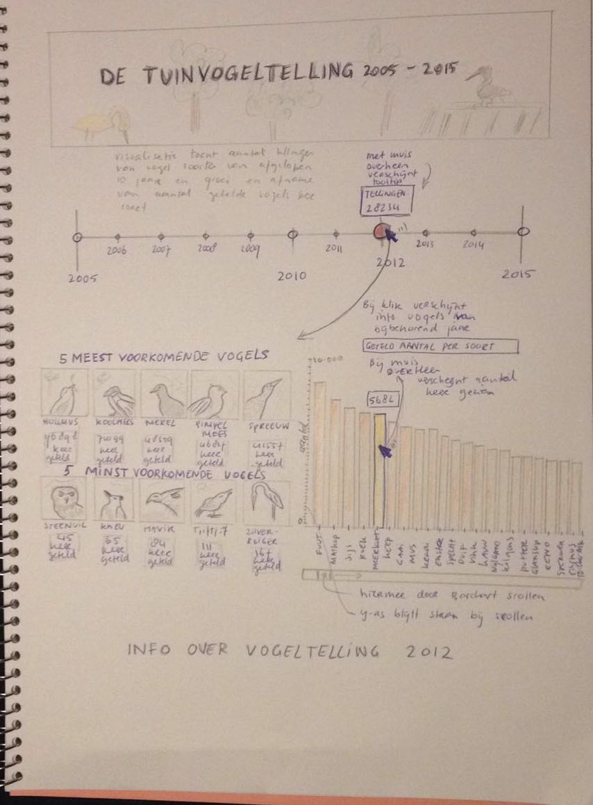
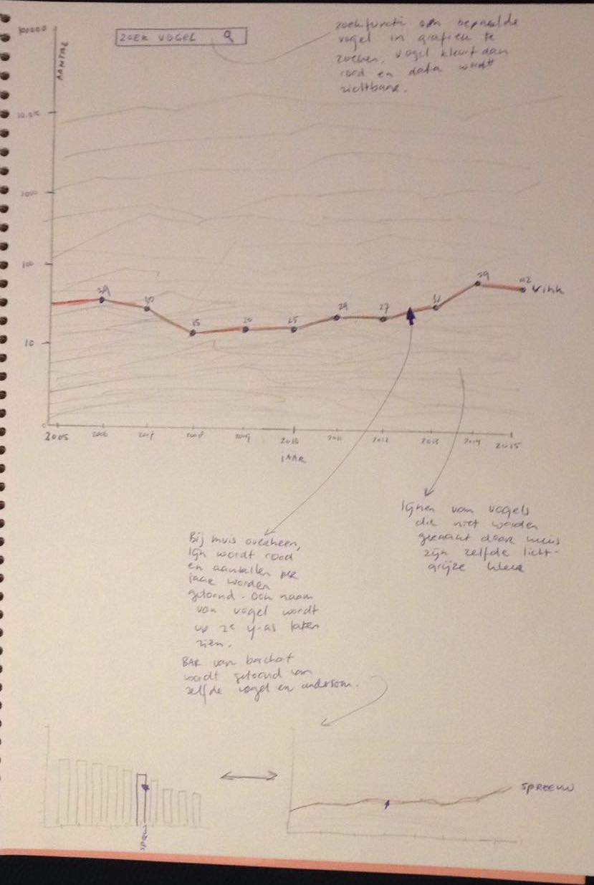

# Design

Tuinvogeltelling 2005-2016
Isa Leijdekkers
10606467

# Schetsen

# Techniek

De schetsen tonen de interactiviteit en de manier waarop de visualisaties aan elkaar gelinkt zijn. Ten eerste is de tijdlijn interactief door de tooltip die opkomt bij de mouse hover en de slider. De slider zal ik implementeren met behulp van d3.
De tijdlijn is gelinkt met de informatie en de barchart doordat de verandering in de tijdlijn, een update van informatie van de vogels en de barchart tot gevolg heeft. Hiervoor zal ik een csv bestand gebruiken die de data bevat van tien jaar van 68 vogels. Met verandering van de slider in de tijdlijn, zullen de waardes van een nieuw jaartal worden gelezen.

De top 5 van minst en meest getelde vogels kan ik bepalen door de hoogste en de laagste waarden te bepalen in de lijst van het betreffende jaar. Hierbij kan ik de naam van de vogel, namelijk de key, opvragen. De slider van de bar chart zal opnieuw met d3 worden gebruikt. Om het overzicht te bewaren blijft de y-as op zijn plek.

De lijngrafiek toont alle data in een geheel. Deze is gelinkt met de visualisatie van de bar chart, doordat bij mouse hover over een bar, de betreffende lijn in de lijngrafiek wordt gekleurd. Hiermee wordt een overzicht gegeven van de verandering in aantal tellingen die heeft plaatsgevonden in de afgelopen tien jaar. Om opnieuw een overzicht te bewaren in de lijngrafiek kan naar een bepaalde vogel worden gezocht. Ook voor deze functie kan d3 worden gebruikt.

# Plugins
D3, tooltip

# Bronnen

Om aan data te komen heb ik contact opgenomen met de tuinvogeltelling. Zij hebben mij een excel bestand gestuurd per mail met data van afgelopen 16 jaar.
