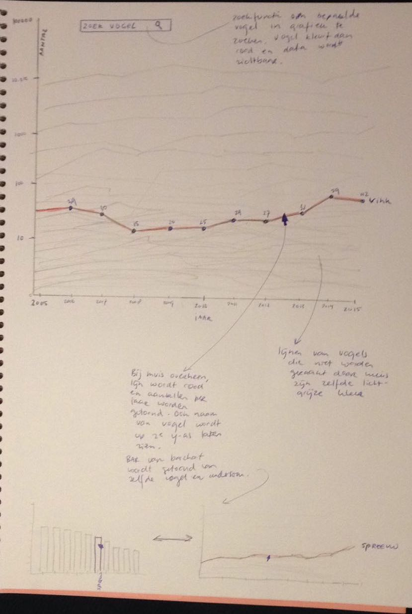

# dag 1

Een eerste idee uitgedacht. Schetsen gemaakt, en een verhaal bedacht wat ik wil vertellen.
De schetsen die ik vandaag gemaakt heb:

# dag 2

Data opgevraagd en ontvangen van de vogelbescherming. Zij hebben mij geen data kunnen geven over provincies en plekken waar de tellingen gedaan zijn in verbang met pricacy. Hierdoor heb ik het plan van de kaart van Nederland moeten verwerpen en een nieuwe visualisatie moeten bedenken. Ik heb vandaag besloten om met enkel te richten op de tuinvogeltelling. Doordat ik data van de afgelopen 16 jaar heb ontvangen heb ik bedacht om in plaats van vanuit een kaart, vanuit een tijdlijn te werken. Ik heb nieuwe schetsen gemaakt, en een nieuw idee uitgedacht. Het onderwerp, vogelsoorten in Nederland, is onveranderd.

Hiervoor heb ik een nieuwe eerste schets gemaakt:

De meer gedetailleerde schetsen die ik heb gemaakt voor de design opdracht:

# dag 3

Vandaag alle data in een csv-bestand gezet. Dataverzameling is afgerond. Mijn plan op kleine punten aangepast naar aanleiding van de feedback van vanochtend. Ik heb een begin gemaakt met de het html, css en javascript bestand. Tot nu toe enkel de titel en een halfwerkende tijdlijn gecreëerd. Zie afbeelding.

