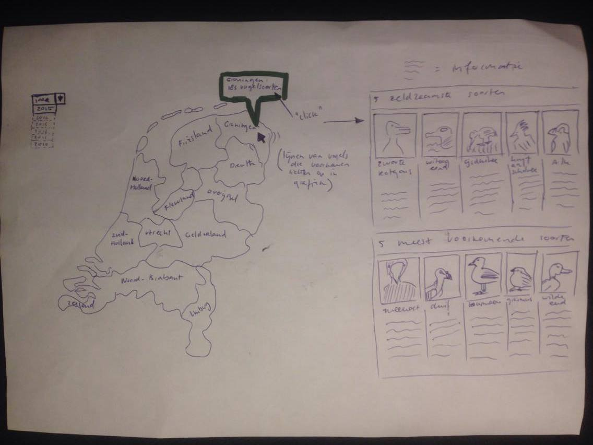
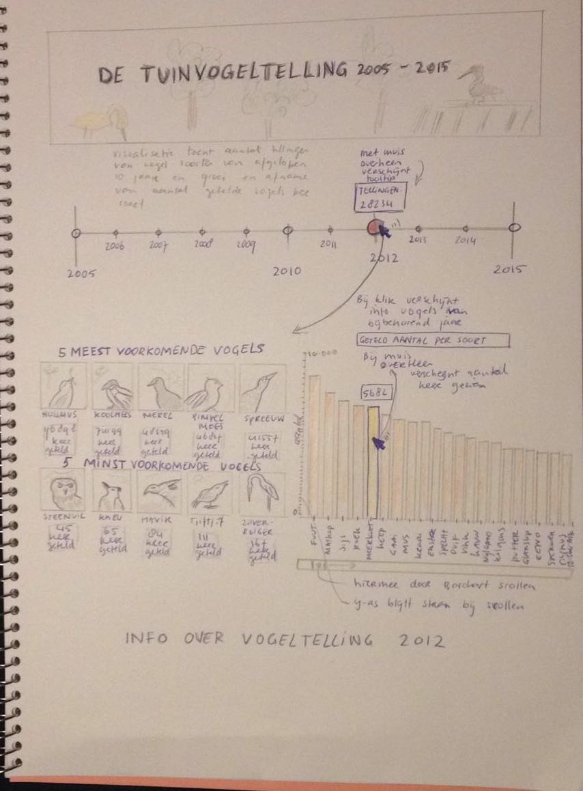
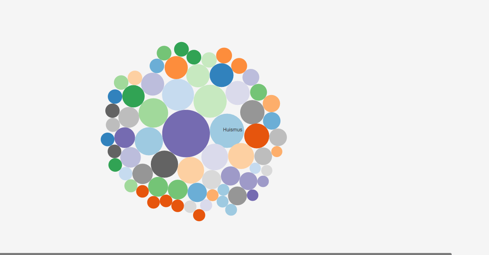

# dag 1

Een eerste idee uitgedacht. Schetsen gemaakt, en een verhaal bedacht wat ik wil vertellen.
De schetsen die ik vandaag gemaakt heb:

# dag 2

Data opgevraagd en ontvangen van de vogelbescherming. Zij hebben mij geen data kunnen geven over provincies en plekken waar de tellingen gedaan zijn in verbang met pricacy. Hierdoor heb ik het plan van de kaart van Nederland moeten verwerpen en een nieuwe visualisatie moeten bedenken. Ik heb vandaag besloten om met enkel te richten op de tuinvogeltelling. Doordat ik data van de afgelopen 16 jaar heb ontvangen heb ik bedacht om in plaats van vanuit een kaart, vanuit een tijdlijn te werken. Ik heb nieuwe schetsen gemaakt, en een nieuw idee uitgedacht. Het onderwerp, vogelsoorten in Nederland, is onveranderd.

Hiervoor heb ik een nieuwe eerste schets gemaakt:

De meer gedetailleerde schetsen die ik heb gemaakt voor de design opdracht:

# dag 3

Vandaag alle data in een csv-bestand gezet. Dataverzameling is afgerond. Mijn plan op kleine punten aangepast naar aanleiding van de feedback van vanochtend. Ik heb een begin gemaakt met de het html, css en javascript bestand. Tot nu toe enkel de titel en een halfwerkende tijdlijn gecreëerd. Zie afbeelding.

# dag 4

Op dag 4 heb ik me vooral verdiept in bootstrap om een mooie layout te kunnen maken voor mijn site. De elementen die ik gister klaas had, heb ik omgezet in bootstrap. Hiermee kan alleen meer een geheel worden en kan ik elementen eenvoudiger en mooier naast en onder elkaar plaatsen. Verder heb ik de tijdlijn afgemaakt, door de tellingen avn het betreffende jaar te tonen wanneer de gebruiker eroverheen gaat met de muis. Ook heb ik een nieuwe header toegevoegd en een footer.

# dag 5

Feedback gekregen op mijn eindplan, maar mist nog 1 visualisatie. Of van de tijdlijn een visualisatie maken, of een extra visualisatie toevoegen met betrekking tot de data over tuinen. Geprobeerd om een tweede viualisatie in  beeld te brengen, maar is nog niet echt gelukt. Morgen ga ik hier mee verder.

# dag 6

Vandaag heb ik de barchart met vogels gemaakt. Hierbij heb ik een extra feature toegevoegd om te kunnen sorteren. Zo kan worden gezien wat de meest getelde vogels zijn en wat de minst getelde vogels zijn. Ook kunnen de vogels weer op alfabetische volgorde worden gezet, om beter een vogel op te kunnen zoeken. Het lukt me niet helemaal om de x-as juist te krijgen, dus dat is wat ik morgen ga oplossen. Morgen wil ik ook de lijngrafiek afhebben en zorgen dat de barchart kan switchen van data.

Mijn project ziet er op dit moment zo uit:

# dag 7

Vandaag heb ik de barchart afgemaakt. Ik ben begonnen met updaten van data wanneer op een jaar geklikt wordt in de tijdlijn. Dit is nog niet af en hoop ik morgen voor elkaar te krijgen. Linken heb ik nog maar 1 keer gedaan en vind ik nog een lastig onderdeel. Ten tweede heb ik vandaag een begin gemaakt met de lijngrafiek. Ik heb nog geen juiste manier gevonden om van de data een grafiek te maken op de manier waarop het nu is opgeslagen. Ik moet nog uitzoeken of het op deze manier kan, of dat ik de data op een andere manier moet formatten. Ook heb ik meer orde aangebracht in mijn mapjes.

# dag 8

Ik heb na veel moeite vandaag mijn lijngrafiek gemaakt. Hier moeten de waarden en de namen van de vogels nog aan toegevoegd worden. Om deze te kunnen maken heb ik het csv bestand moeten aanpassen en gesorteerd op jaar. Een volgende stap is dat ik de barchart aanpas aan deze dataset. Ook de schalen heb ik veranderd in logaritmische schalen omdat het verschil tussen verschillende tellingen erg groot is. Een derde visualisatie wordt de pie chart, deze wil ik naast de barchart plaatsen en met elkaar verbinden.

Mijn project ziet er op dit moment zo uit:

# dag 9

Vandaag ben ik verder gegaan met de lijngrafiek. Nu is het mogelijk om over de lijnen in de grafiek te hoveren en licht deze op. Ook is nu de vogel te zijn waar de lijn bijhoort. Een ander onderdeel dat ik heb toegevoegd aan de lijngrafiek zijn de cirkeltjes die bij het juiste jaar en op de juiste lijn te zien zijn wanneer je eroverheen gaat. Het enige dat nog mist in deze visualisatie is een tooltip bij de cirkeltjes met aantal tellingen en juiste waarden op de y-as en ook een zoekbalk. Een derde visualisatie wordt de volgende stap. Hiervoor wil ik een tabel laten zien met de vogels die het percentage tuinen waarin de vogel voorkomt en de groepsgrootte.

De lijnrafiek ziet er op dit moment zo uit:

# dag 10

Ik heb een begin gemaakt met de zoekfunctie bij de lijngrafiek. En ook heb ik de data aan de juiste jaren gekoppeld. Ik moet alleen nog voor elkaar krijgen dat de bar chart wordt geupdate in plaats van dat elke keer een nieuwe bar chart wordt getoond. Dit weekend wil ik dit afhebbben, samen met de zoekfunctie. Linken en data uitlezen blijken voor mij zeer lastige onderdelen.

# dag 11

Op de 11e dag heb ik toch moeten veranderen van visualisatie, omdat de tabel niet en foto's niet zijn goedgekeurd als losstaande visualisatie. Ik heb bedacht om per jaar ook de groepsgrootte van de vogels te tonen en hierbij ook de soort vogel. Een standvogel, een trekvogel of beide. Vandaag heb ik alle informatie verzameld en toch weer een nieuwe data set moeten maken. Vandag heb ik de bubble chart gemaakt.

De bubblechart ziet er op dit moment zo uit:

# dag 12

Nu begint de tijd te dringen. In plaats van dat ik de bubblechart naast de barchart plaats, maar ik er een eigen onderdeel van onder de lijngrafiek. Vandaag heb ik de bubblechart interactief gemaakt. Met de verschillende bubbels kan gespeeld worden doordat er mee gesleept kan worden. Ook verschijnt er nu een juiste tooltip. Ook is het me vandaag gelukt om de barchart te linken aan het jaar van de tijdlijn. Wanneer op een jaar geklikt wordt, wordt het bolletje van de tijdlijn rood, zodat je kan zien over welk jaar de barchart gaat. Aan de zoekfunctie heb ik ook gewerkt vandaag, maar het lukt me nog niet om deze werkend te krijgen.

Mijn project ziet er op dit moment zo uit:

# dag 13

Vandaag heb ik vooral tijd besteed aan de lijngrafiek. Na een lange tijd is het me gelukt om de zoekbalk te laten werken. Bij de eerste letters lichten de lijnen op die aan de input voldoen. Wat me nog niet lukt is dat de lijnen ook groen blijven wanneer de gebruiker eroverheen hovert. Ook wil ik graag een tooltip laten zien met de vogel die is uitgelicht. Een ander klein onderdeel waar ik aan gewerkt heb is de tooltip van de bubblechart. Morgen wil ik de zoekfunctie gereed hebben, de kleuren hebben uitgezocht voor de bubblechart en een begin maken met het linken van de visualisaties zondat ik me erna kan richten op de opmaak van de site met teksten.

# dag 14

Op dag 14 heb ik heel wat voor elkaar gekregen. Ik heb de kleuren van de bubblechart gemaakt per vogelsoort en daarbij een legenda. De zoekfunctie kan nu op hoofdletters en op kleine letters zoeken, alleen is het me nog niet gelukt om de lijnen te laten staan wanneer er overheen wordt gegaan met de muis. De tijdlijn is met de barchart gelinkt, de barchart is met de lijngrafiek gelinkt, zodat voor elke vogel de telling van de afgelopen jaren zichtbaar wordt. De lijn grafiek is dan weer met de bubble chart gelinkt zodat er meer info over de vogel gezocht kan worden. Tot slot is de bubblechart weer met de lijngrafiek gelinkt. Een laatste onderdeel is eigenlijk dat ik de lijngrafiek met de bubble chart wil linken, alleen zou ik hiervoor over de lijngrafiek moeten skippen.

Mijn project ziet er op dit moment zo uit:

# dag 15

Na wat feedback op mijn werk te hebben gekregen tijdens de presentatie heb ik enkel wat kleine dingen aangepast. Het hoveren over de bubbels maakte de ballen rood, maar hierdoor verdween de oorspronkelijke kleur. Omdat deze kleur informatie over de soort vogel geeft, laat ik nu enkel de randen van kleur veranderen in plaats van het hele oppervlak.

# dag 16

Op deze dag ben ik wat meer bezig geweest met het design van mijn pagina. Ik heb automatische scroll toegevoegd bij klikken van een bepaalde lijn. Ook heb ik een introductie toegevoegd en uitleg bij de bubblechart. Daarnaast heb  ik ook nog aandacht besteed aan de positionering van de verschillende visualisaties. Om de pagina meer een geheel te laten worden en ook meer begrijpelijk te maken heb ik bij elk van de grafieken een soort instructie toegevoegd.

# dag 17

Op dag 17 heb ik nog een aantal dingen aan de code aangepast en als het goed is heb ik de site af. Vandaag heb ik ervoor gezorgd dat de lijnen in de lijngrafiek blijven staan wanneer er op een staaf of op een cirkel wordt geklikt. Andersom blijft nu ook een cirkel geselecteerd bij het klikken op een lijn. Om een stap verder te gaan in het linken heb ik ervoor gezorgd dat ook de betreffende bubbel wordt geselecteerd bij het klikken op een staaf en andersom dat er ook een staaf wordt geselecteerd bij het klikken op een lijn of cirkel. Verder heb ik een deselecteer knop gemaakt, om alle selecties weer te verwijderen. Anders blijft er elke keer een lijn, een bubbel of een staaf geselecteerd. Om het spelen met de bubbels te optimaliseren heb ik ervoor gekozen dat pas bij een dubbele klik de pagina naar de lijngrafiek scrollt. Anders zou bij het loslaten van een bubbel tijdens het spelen de pagina al naar de lijngrafiek gaan.

Mijn project ziet er op dit moment zo uit:

# dag 18

Vandaag report geschreven en positioneringen aangepast. Checkbox werkte niet meer, dus deze heb ik weer gemaakt.

# dag 19

De code is af, en mooi gemaakt. Variabele namen heb ik veranderd. Laatste fingen van het verslag afgemaakt!
