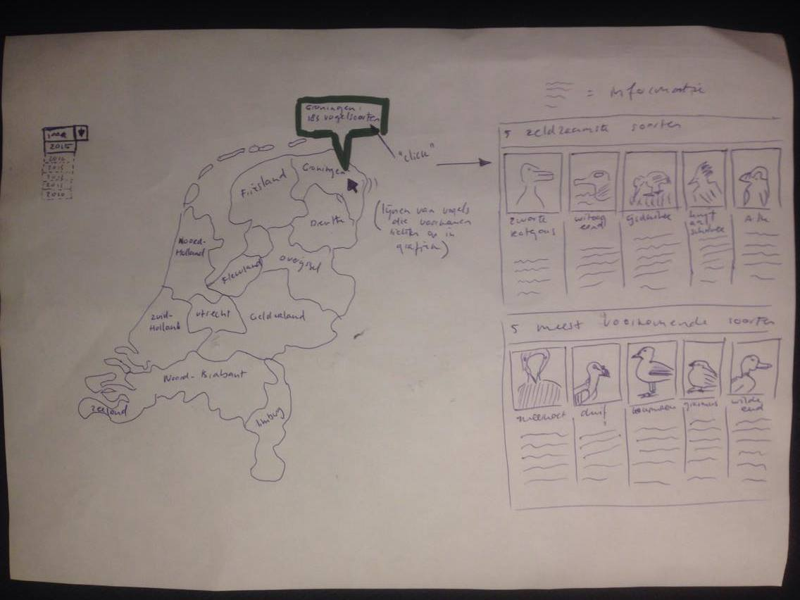

# Programmeerproject

Vogelsoorten in Nederland
Isa Leijdekkers
10606467

# Verhaal

Op 28 en 29 januari vindt de jaarlijkse tuinvogeltelling plaats dat wordt georganiseerd door de Vogelbescherming Nederland. Dit is een telling waarbij de Nederlandse bevolking een half uur lang de verschillende vogels tellen die zich bevinden in de tuin of op het balkon. Vogels die over de tuin heen vliegen tellen niet mee. Het aantal vogels van een bepaalde soort moet worden bijgehouden.

In dit project zou ik graag de vogels en het aantal per soort die zijn geteld in de afglopen jaren in beeld brengen. Ten eerste de vogels zelf, ten tweede het aantal getelde vogels en ten derde de groei/afname van het aantal getelde vogels per soort. Voor mij is het interessant om de meest voorkomende, maar ook de minst voorkomende vogels per jaar weer te geven. Hiermee wil ik interesse opwekken in de tuinvogeltelling. Het is ook mogelijk om van vogels te genieten zonder ze te eten.

# Elementen

De visualisatie bestaat uit vier onderdelen. Omdat ik data heb ontvangen van 16 jaar, wil ik de opdracht graag maken vanuit een tijdlijn. Deze tijdlijn toont de jaren 2005 tot 2015, zodat het een mooie verdeling van 10 jaar is. Het tweede onderdeel is een visualisatie met foto's en info over de top 5 meest getelde vogels en de top 5 minst getelde vogels. Hiernaast zal de derde visualisatie worden getoond, namelijk een barchart met alle 68 vogels waar de gebruiker doorheen kan gaan via een slider. Deze informatie en bar chart worden geupdate wanneer een ander jaartal wordt gekozen.
Een laatste visualisatie is een lijngrafiek die de 68 lijnen toont. Alle lijnen zijn lichtgrijs, maar als de gebruiker er met de muis overheen gaat, dan kleurt de betreffende lijn en worden het aantal tellingen per jaar getoond boven de lijn.

De eerste drie genoemde elementen wil ik zeker laten zien, alleen is nog onduidelijk hoe ik de informatie over de vogels kan weergeven. De lijngrafiek lijkt mij ook noodzakelijk, omdat ik hiermee de verandering over de jaren kan laten zien.

# Schetsen

# Bronnen

De data voor dit project heb ik ontvangen van de vogelbescherming. Zij hebben mij een excel bestand gestuurd met de data van afgelopen jaren.

Data over vogelsoorten in Nederland en over de tuinvogeltelling:

https://www.tuinvogeltelling.nl/hoe-werkt-de-tuinvogeltelling
https://www.dutchbirding.nl/
https://www.sovon.nl/provincies
http://www.vogelatlas.nl/atlas/soorten
https://www.vogelbescherming.nl/ontdek-vogels/kennis-over-vogels/vogelgids
https://en.wikipedia.org/wiki/List_of_birds_of_the_Netherlands

# Verschillende delen

Het eerste deel bestaat uit een tijdlijn die een slider bevat die het mogelijk maakt om een bepaald jaartal te kiezen. Ook bevat de tijdlijn een tooltip, die het aantal tellingen van dat jaar toont.

Het tweede deel bestaat uit in totaal 10 afbeeldingen. Ten eerste die 5 meest getelde vogels en hieronder een rij met de 5 minst getelde vogels. Hieronder staat de naam van de vogels en het aantal keer dat ze geteld zijn.

Het derde onderdeel is een barchart. Deze toont alle 68 vogelsoorten die elk jaar worden geteld. Omdat het er zoveel zijn, bevat deze ook een slider waarme de gebruiker naar rechts en naar links kan. De vogels zijn gesorteerd op aantal keer geteld. Eerst wordt dus de vogelsoort getoond die het meeste keer geteld is. Dit loopt af naar de vogelsoort die het minst aantal keer geteld is. De chart bevat een tooltip die het aantal tellingen bevat.

Het laatste onderdeel, de lijngrafiek, toont de groei en afname van de tellingen per vogelsoort in de afgelopen 10 jaar. Met een mouse-hover wordt de lijn roodgekleurd en worden dots getoond op de plekken van de jaartallen. Boven de dots wordt het precieze aantal tellingen getoond.

# Technische problemen en limitaties

Een technisch probleem lijkt voor mij nu het scherm met de informatie van de vogels. Ik zou graag foto's van de vogels willen tonen, met daarbij de naam en aantal tellingen. Dit heb ik nooit eerder geimplementeerd en hierdoor is het voor mij niet zeker of dit haalbaar is.

Een ander probleem dat hieraan gelinkt is, is het feit dat ik aan 10 jaar informatie wil tonen.
Hiervoor moet ik de informatie over de vogels en de barchart 10 keer kunnen updaten. Op dit moment is het niet zeker voor mij of dit mogelijk is, of dat het een te grote opgave is.

# Vergelijkbare visualisaties

https://www.tuinvogeltelling.nl/resultaten/opmerkelijk
https://www.tuinvogeltelling.nl/resultaten/opmerkelijk/infographic?trend=500
