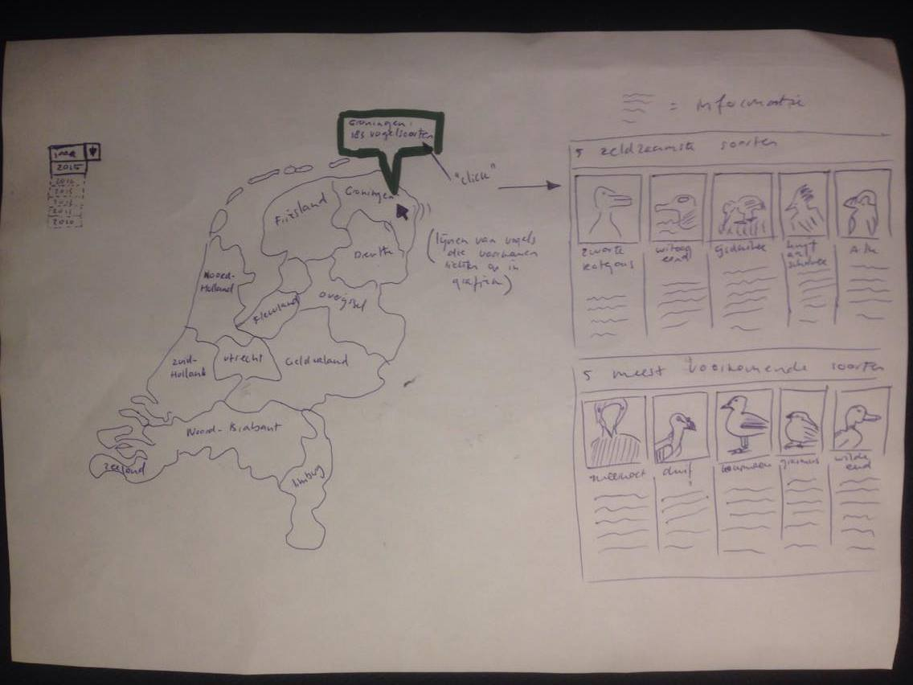
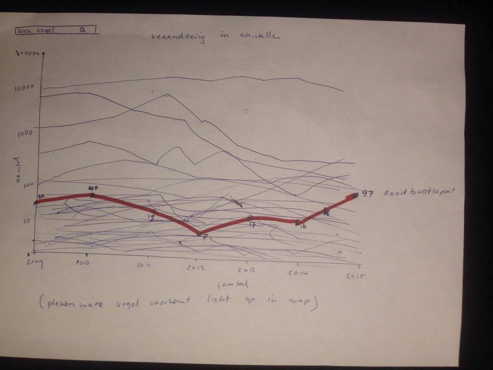

# Programmeerproject

Vogelsoorten in Nederland
Isa Leijdekkers
10606467

# Verhaal

Naar aanleiding van de tuinvogeltelling die 28 en 29 januari plaatsvindt dit jaar,
ben ik op het idee gekomen om de focus te leggen op vogelsoorten in Nederland. De Nederlandse bevolking
kan meedoen aan het evenement door in een gekozen half uur het aantal vogelsoorten te tellen die zich op dat moment in de tuin of op het balkon bevinden. Ook het aantal vogels van de zelfde soort moet worden bijgehouden.

In het jaar 2011 is het hoogste aantal vogelsoorten in Nederland vastgesteld, namelijk rond de 500.
Het aantal van bepaalde soorten vogels neemt continu toe, maar ook af. Met deze visualisaties wil ik graag de toename en afname van vogelsoorten in Nederland tonen, maar ook de verspreiding hiervan. Verder wil ik informatie verstrekken over zeldzame vogelsoorten, maar ook over meest voorkomende soorten. Hiermee wil ik informatie verstrekken en interesse opwekken in gevogelte. Het is ook mogelijk om van vogels te genieten zonder ze te eten.

# Elementen

Graag wil ik een map maken waarin de verdeling van verschillende vogelsoorten in Nederland te zien is. Hiervoor gebruik ik de 278 vogels die zijn opgenomen in de vogelgids van de vogelbescherming.
Per gebied wil ik tonen hoeveel verschillende soorten er ongeveer voorkomen en bij een klik informatie tonen over welke 5 soorten het meest voorkomen en welke 5 soorten juist het meest zeldzaam zijn in dat gebied. Deze verspreiding wil ik van 5 verschillende jaren laten zien. In een dropdown menu kan voor 1 van de jaren gekozen worden en hiermee wordt de informatie op de map geupdate.
Onder de map wil ik graag een lijngrafiek laten zien voor de groei/afname van aantal vogels per soort. Omdat dit 273 soorten zijn wil ik de mogelijkheid geven om naar een vogel te zoeken in de grafiek en die te highlighten, met daarbij dots en informatie over de aantallen.

De grafiek en de kaart wil ik zeker laten zien. Nog niet duidelijk is welke informatie precies in de kaart komt te staan. Het scherm met informatie is nu een eerste idee, maar hier heb ik nog enige twijfel over. Misschien dat de informatie over de vogels op een andere manier geimplementeerd gaat worden.

# Schetsen

# Bronnen
http://www.nu.nl/wetenschap/2445372/vijfhonderd-vogelsoorten-in-nederland.html
https://www.tuinvogeltelling.nl/hoe-werkt-de-tuinvogeltelling
https://www.dutchbirding.nl/
https://www.sovon.nl/provincies
http://www.vogelatlas.nl/atlas/soorten
http://carolinabirds.org/INDEX/NA_index_ad.html
https://www.vogelbescherming.nl/ontdek-vogels/kennis-over-vogels/vogelgids
http://ebird.org/ebird/region/eu?yr=all&m=&rank=mrec
https://en.wikipedia.org/wiki/List_of_birds_of_the_Netherlands

# Verschillende delen

Het eerste deel bestaat uit een chloropeth map, met daarbij een tooltip. Met een klik op een plek wordt informatie getoond over de verschillende vogels. Hierbij wordt een nieuwe scherm aan de rechterkant van de map getoond.
Het tweede deel bestaat uit een lijngrafiek met dots en ook tooltips. Voor beide visualisaties wordt gebruik gemaakt van d3.

# Technische problemen en limitaties

Een probleem waar ik de eerste dag al tegen aanloop is dat het zeer moeilijk is om de vogelsoorten te koppelen aan een gebied. Het aantal soorten per provincie lijkt nergens van belang te zijn. Hiervoor heb ik vogelbescherming een aanvraag gestuurd, waarvan ik nog in afwachting ben van een reactie.
Een technisch probleem lijkt voor mij nu het scherm met de informatie van de vogels. Ik zou graag foto's van de vogels willen tonen, met daarbij een stuk informatie. Dit heb ik nooit eerder geimplementeerd en hierdoor is het voor mij niet zeker of dit haalbaar is.

# Vergelijkbare visualisaties

https://www.sovon.nl/provincies
https://www.sovon.nl/nl/gebieden
https://www.sovon.nl/nl/soort/12260
