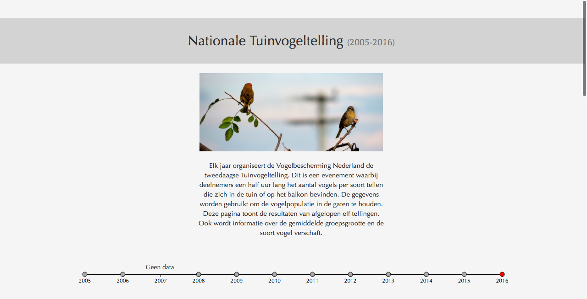
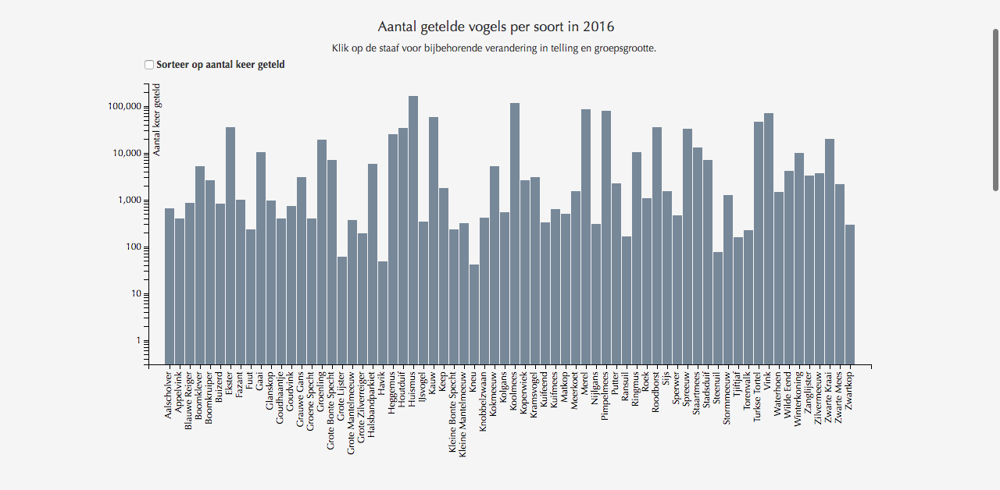
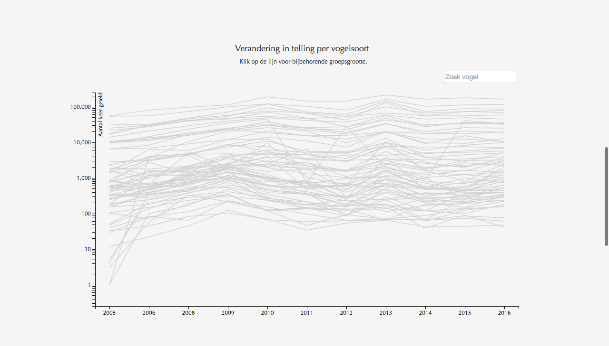
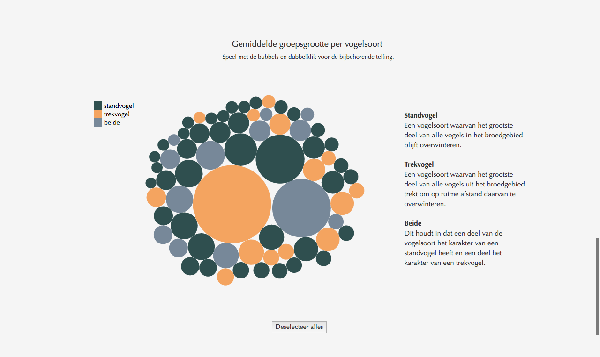
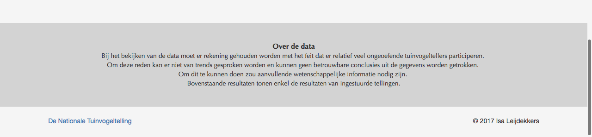

## Programmeerproject

Vogelsoorten in Nederland
Isa Leijdekkers
10606467

## Verhaal

Op 28 en 29 januari dit jaar heeft de 14e editie van de jaarlijkse tuinvogeltelling plaats gevonden. Dit is een evenement, georganiseerd door de Vogelbescherming Nederland, waarbij de deelnemers een half uur lang de verschillende vogels tellen die zich in de tuin of op het balkon bevinden. Vogels die over de tuin heen vliegen tellen niet mee. Het aantal vogels van een bepaalde soort moet worden bijgehouden. De resultaten gebruikt de Vogelbescherming om de vogelpopulatie in Nederland in de gaten te houden. De getelde soorten bestaat uit een lijst van 68 verschillende vogels.

In dit project is het aantal tellingen per vogelsoort in de afgelopen jaren in beeld gebracht. Ten eerste de tellingen per jaar, ten tweede de groei/afname van het aantal getelde vogels per soort en tot slot meer gedetailleerde informatie over de vogelsoorten. Zo wordt een overzicht gecreëerd van de tuinvogeltelling vanuit verschillende hoeken. Hiermee wil ik interesse opwekken in de tuinvogeltelling, maar ook informatie verschaffen over de telling aan deelnemers en toekomstige deelnemers. Het is ook mogelijk om van vogels te genieten zonder ze te eten.

## Elementen

De visualisatie bestaat uit vier onderdelen. De pagina start na een introductie met een tijdlijn. Deze tijdlijn toont de jaren 2005 tot 2016, maar data voor 2007 mist. De reden hiervoor is dat in 2007 de maand waarin de telling plaatsvindt is gewisseld van december naar januari. Het tweede onderdeel is een visualisatie waarin de tellingen per soort en de relatie hiertussen helder wordt weergegeven door middel van een bar chart. Hierop volgt een lijngrafiek die een overzicht biedt van de data van alle elf jaren. Op deze manier wordt de toename en afname in tellingen zichtbaar.
Na de lijngrafiek wordt de gebruiker naar de laatste visualisatie geleid. Deze toont aanvullende informatie over de vogels zelf, die in de eerdere grafieken miste. Deze diagram maakt duidelijk wat de gemiddelde groepsgrootte van de vogel is en daarbij onder welke groep deze valt; van de standvogel of de trekvogel.

## Screenshots

## Bronnen

De data voor dit project heb ik ontvangen van de vogelbescherming. Zij hebben mij een excel bestand gestuurd met de data van afgelopen jaren.

Data over vogelsoorten in Nederland en over de tuinvogeltelling:

https://www.tuinvogeltelling.nl
https://www.dutchbirding.nl
https://www.sovon.nl

# Licensie

Copyright 2017 Isa Leijdekkers

Licensed under the Apache License, Version 2.0 (the "License");
you may not use this file except in compliance with the License.
You may obtain a copy of the License at

http://www.apache.org/licenses/LICENSE-2.0
